# [How SPlit works](@id intuition)

This page walks through the ideas behind SPlit.jl in plain words, with
analogies instead of formulas. If you already know the math and want the
exact quantities and function names, go straight to [Methods](@ref methods).
If you want to see how the methods perform, see [Benchmarks](@ref benchmarks).

## The problem with random splits

Imagine dividing a school class into two teams for a game, by drawing names
out of a hat. Most of the time you get two reasonably balanced teams. But
sometimes the hat gives you all the tall kids on one side, or all the fast
runners, and the game is lopsided before it even starts. Nobody did anything
wrong. The draw was fair, and you were unlucky.

A test set plays the same role for a machine learning model that the second
team plays in that game. It is supposed to be a miniature version of the
whole dataset, so that a good score on it tells you something true about how
the model will do on new data. Random splitting gets this right only on
average, over many hypothetical splits. Any single random split can still be
unlucky: a few outliers, a rare category, or a cluster of similar rows can
all land almost entirely on one side. When that happens, your test score is
noisy, and you cannot tell whether a change in the score came from a better
model or from a luckier split.

SPlit takes a different approach. Instead of drawing names out of a hat, it
looks at the whole class first and deliberately picks a team so that both
teams resemble the class as a whole, tall kids, fast runners, and everyone
else, in proportion. The rest of this page explains how it does that.

## The whole procedure at a glance

Every splitter in this package has the same shape. The rows are first
preprocessed so that every column counts equally. Then `n` of them (the
number of rows selected, the smaller side) are chosen to stand in for all
`N` rows (the total number of rows). The chosen rows become one side of the
split, and everything left over becomes the other side.

Only the middle step differs, and there are four ways to do it.
`SupportPointSplitter` places ideal locations first and then lets each one
claim a real row. `HerdingSplitter` picks rows one at a time, each pick
chosen to fix the current mismatch. `TwinningSplitter` covers the data with
small neighborhoods and takes one row from each. `KernelThinningSplitter`
halves the rows again and again, then keeps the best half.

Read the figure from left to right. The rows enter on the left and pass
through preprocessing. They then take one of the four lanes inside the
highlighted box, and all four lanes end in the same two-sided split. No lane
is marked as the right one, because which lane suits your data is a question
for [Benchmarks](@ref benchmarks).

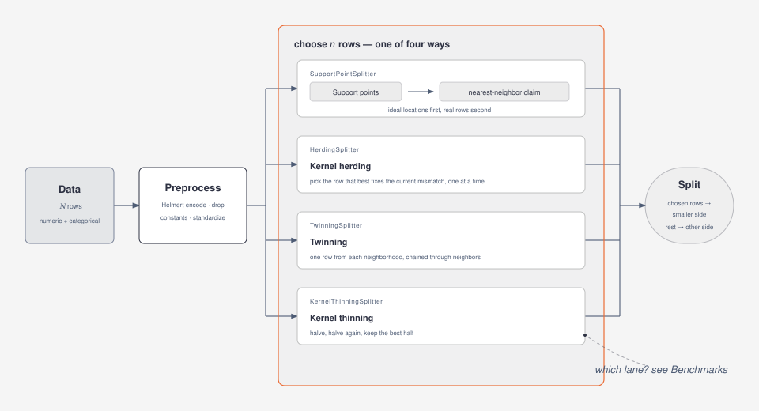
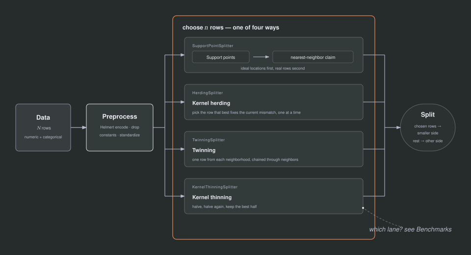

## Measuring "looks like": the energy distance

Before you can choose a split that "looks like" the whole data, you need a
way to measure how much two groups resemble each other. SPlit measures this
with the energy distance.

Picture two groups of people standing in a room, group A on the left, group B
on the right. You want to know whether they were drawn from the same crowd,
or whether they are actually different populations sitting in different
corners. Measure the average distance between a randomly chosen person
from A and a randomly chosen person from B (call this the cross-distance),
and separately measure the average distance between two random people picked
from within A, and within B (call these the within-distances).

If A and B are two random samples from the same crowd, a person from A
is, on average, about as far from a person in B as two people from the same
group are from each other. Cross-distance and within-distances come out
close, and the score is near zero. If instead A and B really are different,
say A is mostly children and B is mostly adults, people across the groups
tend to be farther apart than people within a group, so the cross-distance
grows and the score grows with it. In words, the energy distance is twice
the cross-distance minus the two within-distances; it is zero only when the
two groups come from the same distribution, and grows as they drift apart.
Lower is always better.

The figure below shows the two situations. Grey circles are rows of group
A, blue squares rows of group B. In each panel one orange line measures a
cross-distance (an A row to a B row) and two dashed lines measure a
within-distance (two A rows, two B rows). On the left the groups are mixed
and the three lines are about equally long, so the score is near zero. On
the right the groups sit in different corners, the orange line is much
longer than the dashed ones, and the score is large.

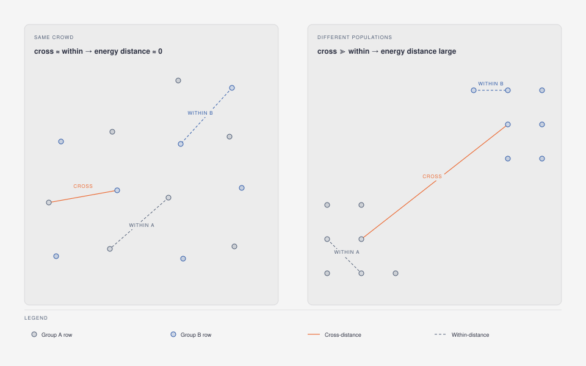
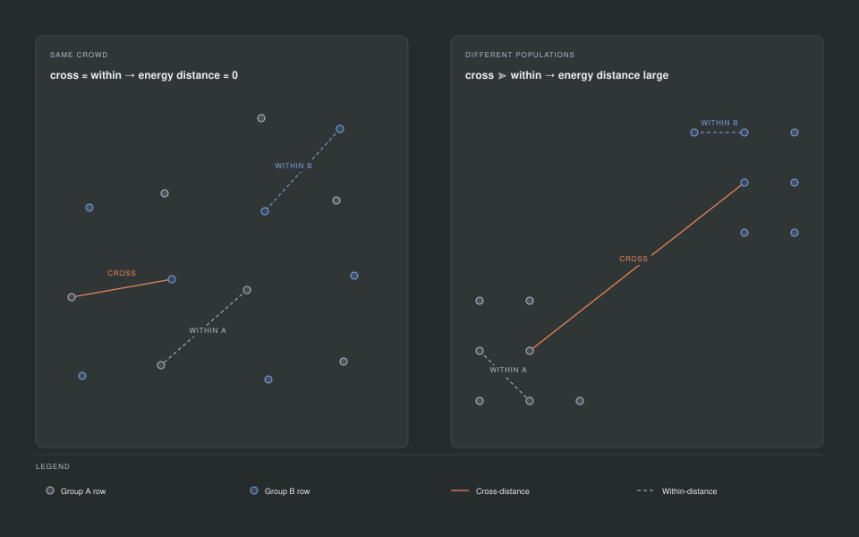

This quantity is implemented by `energydistance`, and `splitquality(data, result)`
computes it between the resulting train and test rows, after the
same preprocessing `datasplit` used internally. When you see "energy
distance" or "discrepancy" elsewhere on this page or in the package, this is
the number being discussed.

## Preprocessing, in one paragraph

Before any distance is measured, the data is put on equal footing. Categorical
columns are turned into numbers by Helmert encoding, in a fixed, canonical
order of the categories' levels, so the result does not depend on the order
the rows happened to arrive in. Columns that never change (constant columns)
are dropped, since they carry no information about how rows differ. Every
remaining column is then standardized to mean 0 and variance 1, so that a
column measured in dollars does not dominate a column measured in years only
because its numbers happen to be bigger.

## Four ways to choose the rows

The four splitters below all chase the same goal: `n` rows whose energy
distance to the whole data is as small as possible. What separates them is
how they search for those rows, and what that search costs. Each one gets an
analogy, a picture, and a note on when to reach for it.

### Support points: choose ideal locations first, rows later

Rather than pick data rows directly, `SupportPointSplitter` first asks a
more abstract question: if I could place `n` points anywhere I like, not
restricted to existing rows, where should they go so that their energy
distance to the full data is as small as possible? The answer to that
question is a set of support points (Mak & Joseph, 2018).

Think of placing `n` ice-cream trucks in a city so that they serve the whole
population well. Each truck is pulled toward where people live (attraction
to the data). But if every truck parked on the single busiest block, the rest
of the city would be poorly served, and the trucks would all look almost
identical to each other, so each truck is also pushed away from where the
other trucks already are (repulsion between the points). Minimizing the
energy distance between the trucks and the population is exactly the
mathematical version of balancing that pull and that push: enough attraction
to sit where the data is dense, enough repulsion to still spread out and
cover where the data is sparse.

The figure shows this balance for one support point, the orange circle,
sitting a little too close to a neighboring support point at the edge of a
dense cluster. The thin hairlines show which rows pull on it. The solid
arrow is the attraction toward those rows, and the dashed arrow is the
repulsion straight away from the crowded neighbor. The orange arrow is the
sum of the two, the diagonal of the faint parallelogram, and the dashed
orange circle is where the point sits next: away from the neighbor, but
still toward the data. The remaining hollow circle is a support point that
already sits well and is left alone here.

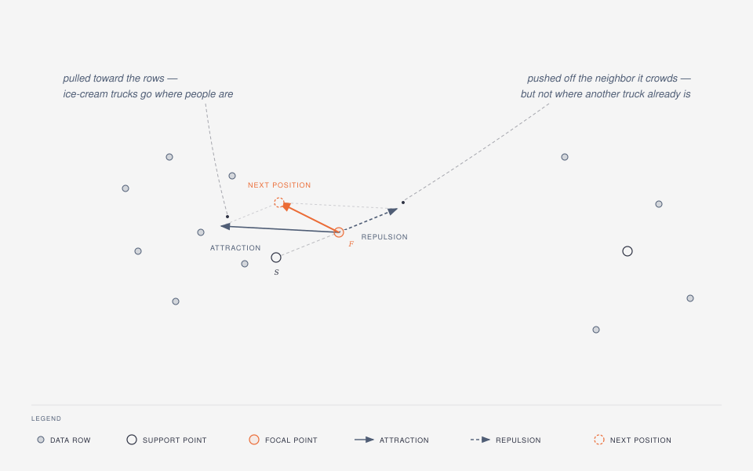
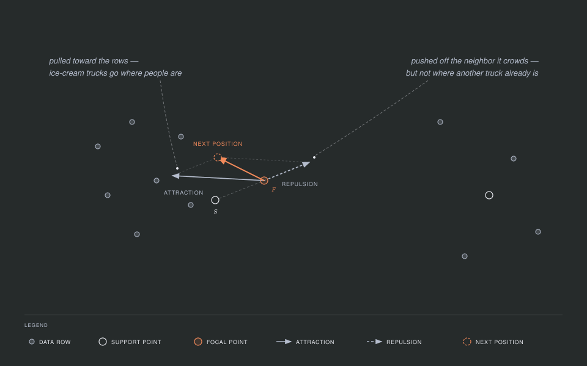

`n` is the size of the smaller side of the split. With `ratio = 0.2` on
1,000 rows, `n` is 200; those 200 points are what the optimizer places.

Reach for support points when you want the procedure of Joseph & Vakayil
(2022) as published, and when the data is large enough that `kappa` (the
size of the per-iteration random subsample, explained below) can buy you
speed:

```julia
using SPlit, Random

data = randn(MersenneTwister(1), 1_000, 3)
support = SupportPointSplitter(ratio = 0.2, rng = MersenneTwister(2))
result = datasplit(support, data)
```

#### How the optimizer moves the points

The points do not appear in their final positions instantly. They start
somewhere and are moved sweep by sweep by an algorithm called
majorization-minimization (MM). At each sweep, every point moves to a
weighted average of two things: the data rows, which pull it (nearby rows
pull harder than far ones, because the pull weight is one over distance),
and the other support points, which push it away, so points do not collapse
onto each other. Every sweep makes the energy distance smaller or, at worst,
leaves it the same, and the descent test in this package checks exactly that
guarantee. Points are clamped
to stay inside the bounding box of the data, so the optimizer never wanders
off to a location no data row is near. The sweeps stop either when the
largest squared move of any point in one sweep drops below `tolerance`, or
after `max_iterations` sweeps, whichever comes first.

The figure takes one sweep apart for a single point, the orange one. The
first panel is the data pull: each line joins the point to a data row, the
near rows are drawn thick because they pull hardest, and the × marks the
weighted average of the rows. The second panel is the repulsion: every other
support point pushes with an arrow of the same length, pointing straight
away from it. The third panel adds the two together, and the orange arrow is
the move that comes out. The dashed circle is where the point lands, and the
dashed rectangle is the bounding box it is clamped into.

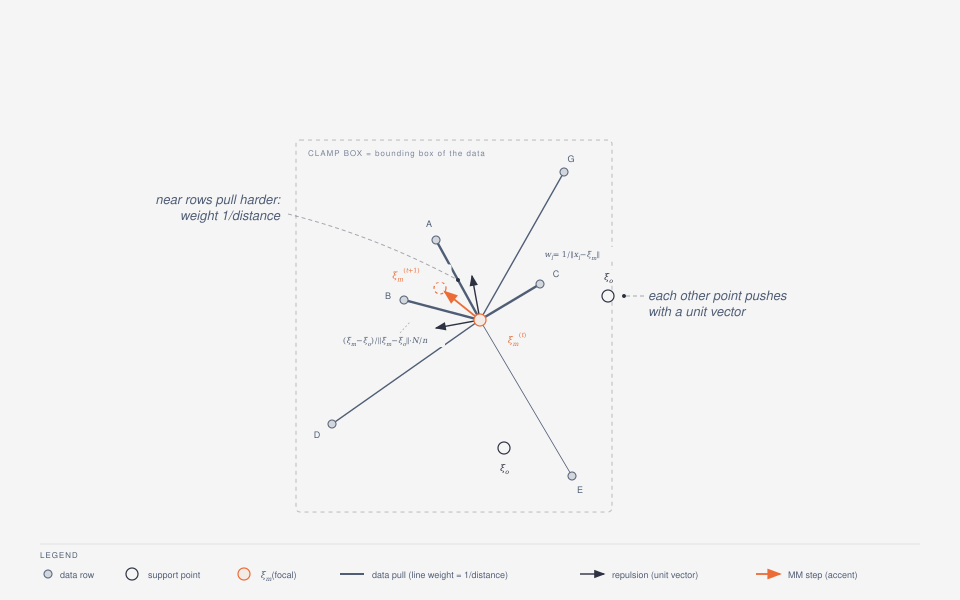
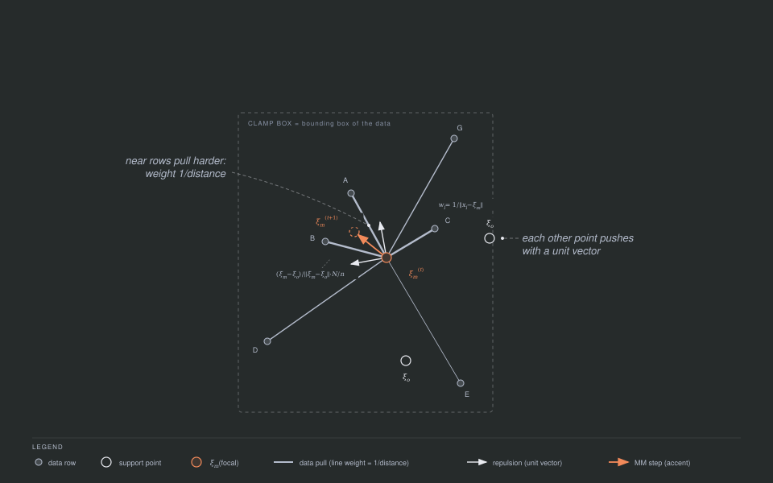

That full-data sweep looks at every row of the data every time, which gets
slow once there are millions of rows. For large data, `kappa` switches on a
stochastic variant (Joseph & Vakayil, 2022): instead of looking at every
row, each sweep looks at a fresh random sample of `kappa` rows (an absolute
row count, not a fraction of the data), and blends the new position with a
running average of the previous positions so that the noise from sampling
different rows each time averages itself out over many sweeps. The price of
this speed-up is that the strict never-worse guarantee no longer holds sweep
by sweep, since each sweep only sees part of the data. Stochastic mode only
switches on when `kappa` is smaller than the number of rows in the data;
otherwise the full, monotone sweep is used.

#### From points to rows: nearest-neighbor assignment

Support points are ideal locations, not rows that exist in your data. The
next step turns them into an actual subset. Each support point, taken in
turn, claims the nearest data row that no earlier point has already claimed,
much like a game of musical chairs where each player in turn sits in the
nearest empty chair. This search is served by a k-d tree, so it stays fast
even with many rows and many points.

The figure follows three turns of that game. Hollow circles are support
points, numbered in the order they pick, grey circles are rows nobody has
claimed, and filled circles are rows that have been claimed. In the first
two turns, points 1 and 2 simply take their nearest row. In the third turn
the orange point finds its nearest row already taken, shown by the dashed
line, so it claims the next nearest row instead.

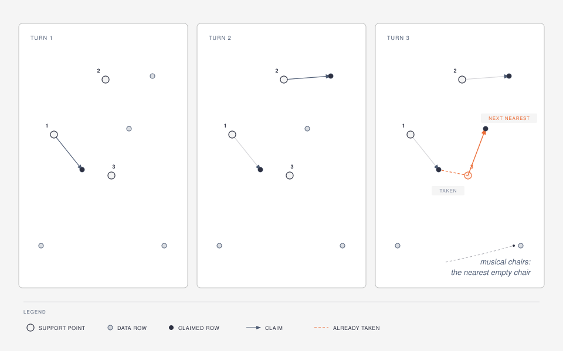
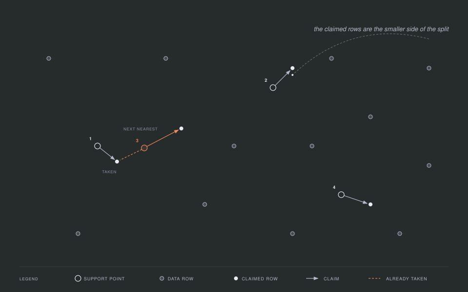

The set of claimed rows is the smaller of the two subsets. If `ratio <= 0.5`,
that smaller subset becomes the test set and the rest becomes the training
set; otherwise it is the other way around, the claimed rows become the
training set and the rest become the test set.

The result gives you a few equivalent ways to get at the two subsets:

```julia
train, test = result
train = data[result, :train]
test = data[result, :test]
train_indices(result)
test_indices(result)
```

### Kernel herding: pick the rows one at a time

`HerdingSplitter` takes a different route to the same goal. Rather than
first placing abstract support points and then matching them to rows, it
picks data rows directly, one at a time, by kernel herding (Chen, Welling &
Smola, 2010). Each pick is the unselected row that best improves the match
between "the rows picked so far" and the whole data.

This is like assembling a sports team one player at a time: rather than
draft the objectively best player each round, at every step you pick whoever
best balances the team you have already assembled, so the finished roster as
a whole represents the full pool of talent.

In the figure, three rows have already been picked, and all three sit in the
left cluster. The right cluster is shaded, because nothing has been picked
there yet, so the rows picked so far describe it badly. The orange ring
marks the next pick: the row that most reduces that mismatch, which is a row
from the right cluster.

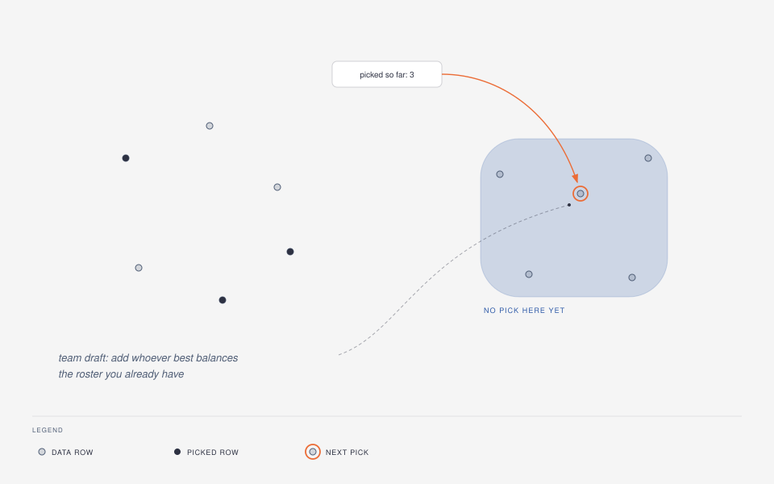
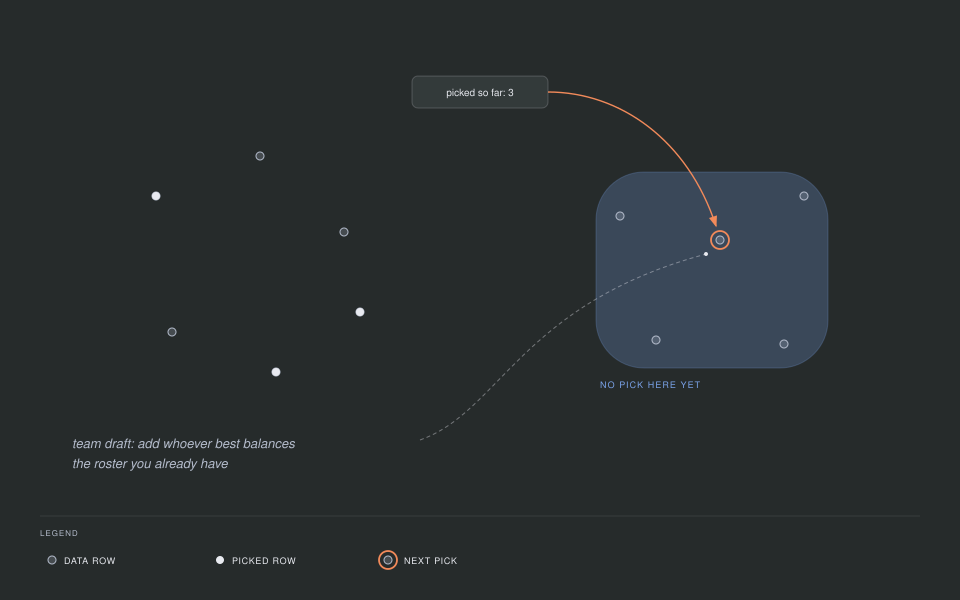

```julia
herding = HerdingSplitter(kernel = GaussianKernel(), rng = MersenneTwister(6))
result = datasplit(herding, data)
result.iterations   # number of rows selected
```

`HerdingSplitter` is deterministic given the data and a numeric kernel; the
`rng` only comes into play to resolve a `:median` bandwidth. Its comparison
to the whole data is always computed exactly, at a cost that grows with the
square of the number of rows, and `result.iterations` counts the number of
rows it has selected. Prefer it when you want a split that is fully
determined by the data and the kernel, with no random initialization and no
optimizer to tune; see [Benchmarks](@ref benchmarks) for how it compares
against support points in practice.

### Twinning: one row from every neighborhood

`TwinningSplitter` (Vakayil & Joseph, 2022) does no optimization at all. It
covers the data with `n` small neighborhoods and takes exactly one row from
each, so every row it leaves behind has a chosen row close by.

Think of surveying a town by walking it block by block. You start at the
house farthest from the town center and interview one household there, then
mark that house and its immediate neighbors as done. Next you walk from the
far edge of that little block to the nearest house you have not visited yet,
and repeat. You end up covering the whole town evenly, one household per
block, without ever needing a map of the whole place at once.

The algorithm is that walk. The first start row is the row farthest from the
centroid of the standardized data, which is what `start = :farthest`, the
default, means. Each group is its start row together with its `r - 1`
nearest rows that no group has taken yet, where `r` is `N ÷ n`. The next
start row is the ungrouped row nearest the farthest member of the group just
formed. The selection is the start rows, one per group, and the objective
being served is still the energy distance.

In the figure the small × marks the center of the data. The first start row
is the one farthest from it, ringed in orange. It takes its two nearest
ungrouped rows, and the dashed outline around the three is the first
neighborhood. An arrow leaves the farthest member of that neighborhood and
lands on the nearest ungrouped row, which starts the next one. Filled
circles are the selected rows, one from each neighborhood.

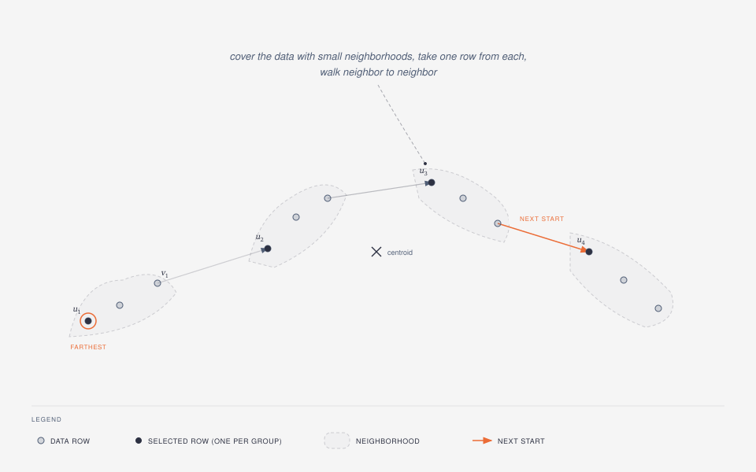
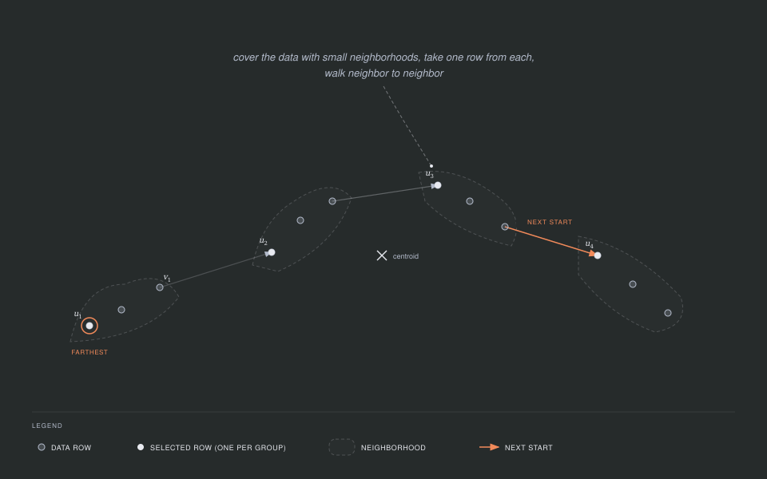

```julia
twin = TwinningSplitter(rng = MersenneTwister(9))
result = datasplit(twin, data)
folds = multiplet(twin, data, 5)
```

With the default `start = :farthest` the walk consumes no randomness, so the
result is fixed by the data alone and the `rng` above matters only for
`start = :random`. Twinning has no kernel to choose and no optimizer to
tune, which makes it the fastest of the four once the data is large. In
exchange it is the least
flexible: `weights` and `reference`, both described below, are not defined
for it and raise an `ArgumentError`. It is also the only splitter that can
run `multiplet(twin, data, k; strategy = :single)`; the other two
strategies, `:sequential` and `:halving`, work with any splitter.

### Kernel thinning: halve, halve again, keep the best half

`KernelThinningSplitter` (Dwivedi & Mackey, 2022, 2024) reaches the subset by
repeated halving rather than by a greedy walk, and it carries a guarantee
about how good the result is.

Picture dealing a shuffled deck into two piles. You take the cards two at a
time and put one in each pile, but you do not always deal them in the order
they arrived: whenever the two piles start to drift apart, you flip which
card goes where, so the piles stay balanced as you go. At the end either
pile is a fair miniature of the whole deck, and you halved the deck in a
single pass.

Kernel thinning deals the rows exactly that way, and then repeats the
halving. Rows are visited in pairs, in a random order, one row of each pair
going to each pile, and the assignment is flipped with a probability that
keeps the piles balanced. Halving the rows `log2(N / n)` times, rounded
down, turns the front of the shuffle into several candidate subsets of size
`n`. A plain uniform random subset joins them as a baseline, every candidate
is compared against the whole data, and the winner is improved by one swap
pass that trades a chosen row for an outside row wherever that helps.
Because the random baseline is one of the candidates, the outcome is never
worse than a random subset.

Read the figure from left to right. Sixteen rows are halved into two piles of
eight, each pile is halved again, and the four subsets of four rows are the
candidates. The dashed box below them is the random baseline that joins the
comparison. The best of the five goes through the swap pass, drawn as one
row leaving and one row entering, and what comes out is the selection. The
inset shows a single halving step: a pair of rows, one going to each pile,
and the flip that keeps the piles from drifting apart.

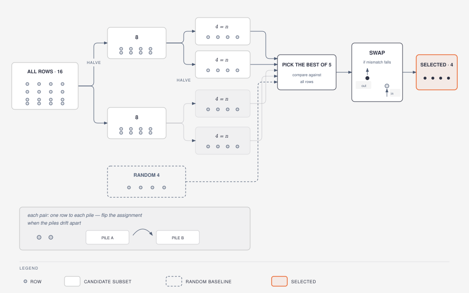
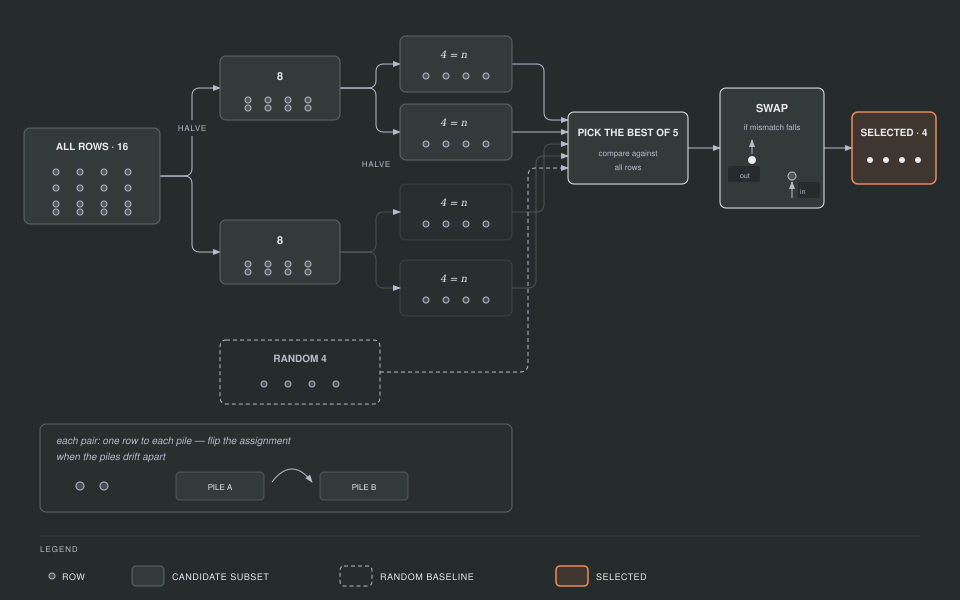

```julia
thinning = KernelThinningSplitter(rng = MersenneTwister(10))
result = datasplit(thinning, data)
result.iterations   # number of swap replacements
```

The guarantee, in words: each halved candidate stays close to the rows that
entered the halving, measured by the maximum mean discrepancy (MMD) of the
next section, and it does so with high probability. `delta` is the failure probability of that guarantee,
0.5 by default, the value the papers use in their experiments. The cost
grows with the square of the number of rows, the same class as kernel
herding, so reach for kernel thinning when you want the guarantee and your
data fits that budget. When `n` is a tiny fraction of `N` there is a
near-linear variant, Compress++ (Shetty, Dwivedi & Mackey, 2022), which
`compress = :auto` turns on for you. It is defined only for the data's own
distribution, so it never fires with `weights` or `reference`, and it does
not fire at the default 20% ratio either.

## How much to hold out: the optimal ratio

Choosing a split ratio is itself a trade-off. A model with more parameters
needs more training rows to be estimated well, which argues for a small test
set. But a test set that is too small gives you a noisy performance number,
since it is averaging over very few rows. Joseph (2022) works out where the
balance point sits: for a linear model with `p` parameters, including the
intercept, the test fraction that minimizes the variance of the fitted model
is one divided by the square root of `p` plus one, written as `γ = 1/(√p + 1)`.

A few values make the shape of that curve concrete:

| `p` (parameters, intercept included) | optimal test fraction |
|---:|---:|
| 2 | 0.41 |
| 5 | 0.31 |
| 10 | 0.24 |
| 26 | 0.16 |
| 101 | 0.09 |

Plotted as a curve, the same formula drops steeply for the first few
parameters and then flattens: past a few dozen parameters the optimal test
fraction changes very little. The dots mark the five rows of the table,
and the dashed line is the default `ratio = 0.2`, which the curve crosses
at about 16 parameters.

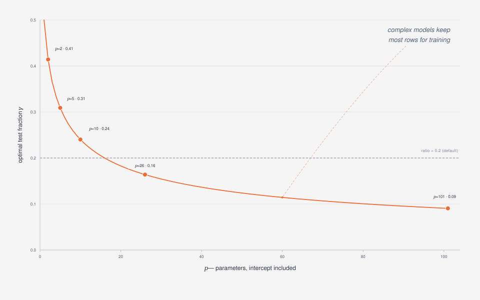
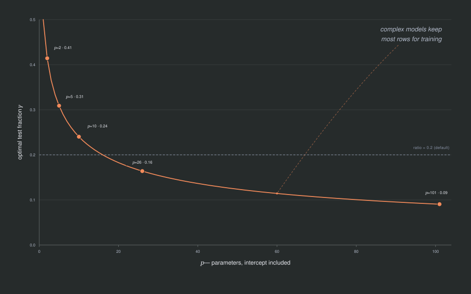

Simple models, with few parameters, can afford to give up a large share of
the data for testing. Complex models, with many parameters, need to keep
most of the data for training, and the formula's test fraction shrinks
accordingly.

`optimal_split_ratio(x, y)` computes this for you, counting `p` as the
number of encoded predictor columns of `x` (after the same preprocessing
described above) plus one for the intercept:

```julia
x = randn(MersenneTwister(3), 500, 4)
y = randn(MersenneTwister(4), 500)
optimal_split_ratio(x, y)
```

Only `method = :simple` is implemented. The paper also describes a
`method = :regression` strategy for when the model is unknown, which SPlit.jl
does not implement yet; calling it raises an error on purpose rather than
silently falling back to `:simple`.

## A different ruler: the Gaussian kernel and MMD

The energy distance measures how far apart two points are with a plain
straight-line ruler. `GaussianKernel(σ)` swaps that ruler for a similarity
score instead of a distance: it is 1 when two points are identical, and
fades smoothly toward 0 as the points move apart, with `σ` controlling how
quickly the similarity fades. The matching notion of "looks like" under this
similarity is called the squared maximum mean discrepancy, MMD², and `mmd`
computes it. In fact the energy distance is a special case of MMD²: it is
what you get when the kernel is "minus the distance" between two points, so
`EnergyKernel` and `GaussianKernel` are two members of the same family that
differ only in the ruler.

The MM update described above is derived specifically for the energy
distance, so it does not carry over to the Gaussian kernel unchanged. The
Gaussian kernel has its own MM sweep instead (a mean-shift data term and a
majorized repulsion term; see the [Methods](@ref methods) page), which
`kappa` mode uses. On full data, the optimizer uses projected gradient
descent with backtracking: take a step downhill, and if that step did not
actually decrease the objective, shrink it and try again. This also
produces a sequence of accepted steps that never makes the objective worse.

```julia
gauss = SupportPointSplitter(kernel = GaussianKernel(), rng = MersenneTwister(5))
result = datasplit(gauss, data)
result.method.kernel                                    # resolved bandwidth
splitquality(data, result; kernel = result.method.kernel)
```

`bandwidth = :median`, the default, picks `σ` as the median pairwise
distance between the standardized rows, resolved once when `datasplit` runs,
and the resolved kernel (with a plain number in place of `:median`) is
stored in `result.method.kernel`, as shown above. Two things to watch for.
`:median` raises an `ArgumentError` when at least half of all row pairs
coincide exactly, which happens for example with a single binary categorical
column. In that case pass a numeric `σ` instead, chosen on the scale of the
standardized data: a bandwidth far below the spacing between rows makes the
objective flat, and the optimizer never moves away from its starting sample.
`kappa`, the stochastic large-data mode described above, is available for
`GaussianKernel` too: it runs the Gaussian kernel's own MM sweep on
subsamples, while full data keeps projected gradient descent.

## Big datasets: estimators

Both the exact energy distance and the exact MMD compare every row against
every other row, so their cost grows with the square of the row count. Once
a dataset is large, that quadratic cost becomes the bottleneck, so the
`estimator` keyword on `energydistance`, `mmd`, and `splitquality` lets you
trade a small amount of exactness for a large amount of speed:

- `Subsample(m, repeats)` measures the exact discrepancy on random subsets of
  `m` rows and averages the result over several repeats. It is fast, but the
  estimate is biased upward by an amount of order `1/m`, so treat it as a way
  to compare two splits against each other, not as an absolute number on its
  own.
- `RandomSlices(k)` projects every row onto `k` random directions, like
  shining a light on the cloud of points from several angles and looking at
  the shadow it casts on a line, and computes the exact one-dimensional
  energy distance along each direction. It is unbiased, and only defined for
  the energy kernel.
- `RandomFeatures(D)` approximates the Gaussian similarity with `D` random
  cosine features (Rahimi & Recht, 2007), turning the comparison into a
  difference between two averages of those features. It is unbiased, and
  only defined for the Gaussian kernel.

```julia
energydistance(data[1:500, :], data[501:1000, :]; estimator = RandomSlices(64))
mmd(data[1:500, :], data[501:1000, :], GaussianKernel(1.0); estimator = RandomFeatures(512))
```

`splitquality` chooses among these for you: it uses `Exact()` automatically
whenever the train and test rows together number at most 20,000, and above
that count switches to a fallback estimator chosen by the
[Estimator selection](@ref estimator-selection) experiment on the Design
experiments page.

Kernel herding intentionally has no estimator mode. When the greedy pick at
each step used an approximate comparison instead of the exact one, the
measured result was worse than a plain random split, so its data term stays
exact; see [Approximate herding data terms (rejected)](@ref herding-estimators-rejected)
on the Design experiments page for the measurement.

## Beyond one train/test split

The same machinery answers three more questions, and each answer is a
keyword rather than a different splitter.

Some rows deserve to count more than others. `weights` gives every row a
non-negative number and asks for a subset that represents that weighted
picture of the data instead of the plain one. Weights proportional to
duplication counts behave exactly like duplicating those rows. The subset
that comes back is always plain, with every chosen row counting once.

Sometimes the distribution you want to match is not the data you are
choosing from. `selectrows(splitter, data, n; reference = other)` picks `n`
rows of `data` so that they resemble `other`, which is how you assemble a
sample that mirrors a target population you already have. The preprocessing
is fit on the reference, so both tables are measured on the reference's
scale, and the candidates are always rows of `data`. Since `weights` and
`reference` name two different targets, you may pass one or the other but
not both.

For cross-validation, one split is not enough. `multiplet(splitter, data, k)`
returns `k` folds that together partition the rows, with sizes differing by
at most one, and each fold resembles the whole data rather than merely being
random. Every splitter can produce them.

Finally, `standardize = false` turns preprocessing off entirely, including
the constant-column removal, and uses a numeric matrix exactly as it is.
That is the mode for embeddings, whose geometry per-column standardization
would distort; the [LLM data-selection guide](@ref llm-data-selection) walks
through that workflow.

## Comparing splitters

When you are not sure which splitter or kernel suits your data best,
`compare` runs several configurations on the same data and scores each one:

```julia
comparison = compare(
  [SupportPointSplitter(rng = MersenneTwister(7)), HerdingSplitter(rng = MersenneTwister(8))],
  data,
)
comparison            # prints as a table: method, kernel, ratio, sizes, score
method, result = best(comparison)   # the lowest-discrepancy pair
```

## Cheat sheet

| Concept | Where it lives |
|---|---|
| Energy distance | `energydistance`, `splitquality` |
| Support points and MM optimization | `SupportPointSplitter(kernel = EnergyKernel())` |
| Large-data stochastic mode | `kappa` |
| Gaussian kernel and MMD | `GaussianKernel`, `mmd` |
| Kernel herding | `HerdingSplitter` |
| Twinning | `TwinningSplitter` |
| Kernel thinning and Compress++ | `KernelThinningSplitter`, `compress` |
| Row assignment from points | inside `datasplit` (nearest-neighbor claim) |
| Optimal split ratio | `optimal_split_ratio` |
| Speeding up large data | `estimator` (`Subsample`, `RandomSlices`, `RandomFeatures`) |
| Rows that count more | `weights` |
| Matching another table | `reference`, `selectrows` |
| Folds that each look like the whole | `multiplet` |
| Embeddings, no preprocessing | `standardize = false` |

## Where to go next

The [Methods](@ref methods) page states the same ideas as formulas, with the
exact function that implements each one; read it once the shapes above feel
familiar and you want the precise definitions. The
[Benchmarks](@ref benchmarks) page shows how the splitters compare against
each other, and the [Design experiments](@ref design-experiments) page
carries the estimator measurements mentioned above. The
[Reference](@ref reference) section carries the full docstrings for every
exported name.

## References

- Chen, Y., Welling, M., & Smola, A. (2010). Super-Samples from Kernel Herding. *UAI*, 109-116.
- Dwivedi, R., & Mackey, L. (2022). Generalized Kernel Thinning. *ICLR*.
- Dwivedi, R., & Mackey, L. (2024). Kernel Thinning. *Journal of Machine Learning Research*, 25(152), 1-77.
- Gretton, A., Borgwardt, K. M., Rasch, M. J., Schölkopf, B., & Smola, A. (2012). A Kernel Two-Sample Test. *Journal of Machine Learning Research*, 13, 723-773.
- Joseph, V. R. (2022). Optimal Ratio for Data Splitting. *Statistical Analysis and Data Mining: The ASA Data Science Journal*, 15(4), 531-538.
- Joseph, V. R., & Vakayil, A. (2022). SPlit: An Optimal Method for Data Splitting. *Technometrics*, 64(2), 166-176.
- Mak, S., & Joseph, V. R. (2018). Support points. *The Annals of Statistics*, 46(6A), 2562-2592.
- Rahimi, A., & Recht, B. (2007). Random Features for Large-Scale Kernel Machines. *NIPS*, 20.
- Shetty, A., Dwivedi, R., & Mackey, L. (2022). Distribution Compression in Near-Linear Time. *ICLR*.
- Székely, G. J., & Rizzo, M. L. (2013). Energy statistics: A class of statistics based on distances. *Journal of Statistical Planning and Inference*, 143(8), 1249-1272.
- Vakayil, A., & Joseph, V. R. (2022). Data Twinning. *Statistical Analysis and Data Mining*, 15(5), 598-610.
