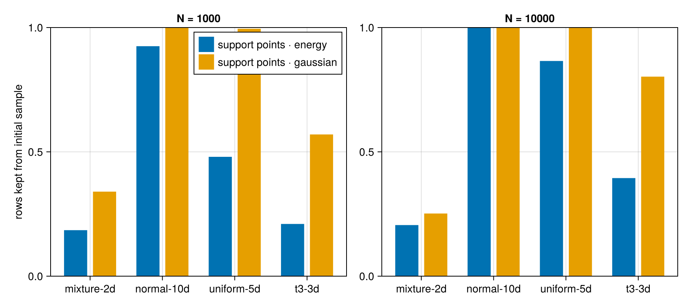
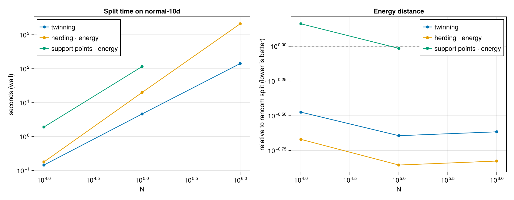

# [Benchmarks](@id benchmarks)

**Use `herding · energy` by default; use `kernel thinning` when MMD is the
criterion.** On four synthetic datasets at N = 1,000 and 10,000
`herding · energy` has the lowest energy distance in 4 of 8 cases and
`kernel thinning · energy` in 3, and the two stay within 0.85-1.06x of each
other everywhere; on Gaussian MMD kernel thinning wins 6 of 8. Herding is
also the fastest optimized method in every cell, 26-100x faster than the
support-point optimizer and 8.6-11x faster than kernel thinning at
N = 10,000. Sections 1 and 2 are the evidence; section 3 is
why support points fall behind. The setup is under
[How it was run](@ref benchmarks-environment). Section 4 shows where
`twinning` fits at N up to 10⁶.

## 1. Quality: `herding · energy` and `kernel thinning` share the wins

Each marker is one method on one (dataset, N) cell. The y axis is that
method's discrepancy divided by the random split's, so 1 means no better
than random and lower is better. Left: energy distance, the quantity the
three `energy` methods minimize. Right: Gaussian MMD, the quantity the
three `gaussian` methods minimize.

- `herding · energy` has the lowest energy distance in 4 of 8 cells and
  `kernel thinning · energy` in 3; `support points · energy` takes the
  remaining one (`mixture-2d` at N = 1,000). The two leaders are close
  everywhere: `kernel thinning · energy` is between 0.85x and 1.06x of
  `herding · energy` in every cell.
- On MMD, kernel thinning wins 6 of 8 cells — the Gaussian kernel on
  `mixture-2d` and `t3-3d` at N = 1,000 and `t3-3d` at N = 10,000, the
  energy kernel on `uniform-5d` at both N and `mixture-2d` at N = 10,000.
  Herding takes the two `normal-10d` cells.
- `support points · gaussian` is no better than random on `normal-10d` and
  `uniform-5d` at either N, and `support points · energy` on `normal-10d`
  at N = 10,000. Section 3 explains why.
- `herding · gaussian` is 4.9x worse than random on the `mixture-2d`
  energy distance at N = 10,000. A method only controls the metric it
  optimizes, so pick the kernel that matches how you will judge the split.

| dataset | N | lowest energy distance | lowest MMD |
|---|---:|---|---|
| mixture-2d | 1000 | support points · energy | kernel thinning · gaussian |
| normal-10d | 1000 | herding · energy | herding · gaussian |
| uniform-5d | 1000 | herding · energy | kernel thinning · energy |
| t3-3d | 1000 | kernel thinning · energy | kernel thinning · gaussian |
| mixture-2d | 10000 | kernel thinning · energy | kernel thinning · energy |
| normal-10d | 10000 | herding · energy | herding · energy |
| uniform-5d | 10000 | herding · energy | kernel thinning · energy |
| t3-3d | 10000 | kernel thinning · energy | kernel thinning · gaussian |

Every cell's fastest optimized method is `herding · energy`. All numbers:
[`assets/benchmarks/results.md`](assets/benchmarks/results.md).

## 2. Speed: herding is 26-100x faster than support points

Wall time against N, log-log, JIT warm-up excluded; the random split is
not shown because it does no work. At N = 10,000 `herding · energy` takes
0.13-0.21 s and `herding · gaussian` 0.42-0.52 s; `kernel thinning · energy`
takes 1.2-1.9 s and `kernel thinning · gaussian` 2.7-3.2 s. The two
support-point methods take 3.6-8.9 s and 5.4-13.0 s, 26-100x the
`herding · energy` time. Herding's cost is one `O(N²)` pass for the data
term plus `O(nN)` for the selections, with no iterations, step sizes or
`kappa` to tune. Kernel thinning is in the same class: the same `O(N²)`
data-term pass, plus `O(L²)` kernel evaluations for the halvings and an
`O(nN)` swap pass ([Kernel thinning](@ref kernel-thinning)).

## 3. Why support points fall behind on `normal-10d` and `uniform-5d`

`SupportPointSplitter` optimizes continuous points, then rounds each one to
its nearest unclaimed data row. The points start at a random sample of
rows. If the optimizer moves a point less than the spacing between rows, it
rounds back to its own starting row. When that happens to every point, the
split is the initial random sample and the optimization is discarded.

The figure shows the fraction of starting rows each method keeps. On
`normal-10d` and `uniform-5d` at N = 10,000 it is 87-100%. On `normal-10d`
the median move is 0.14 (standardized units) against a row spacing of 1.37.

The optimizer is not the problem. Its continuous points reach an MMD of
2.3e-6 to the data, the same level as `herding · gaussian`. The rounding
step throws that away. Starting the points away from data rows does not
help (12-18x worse than random on `normal-10d`). Herding selects rows
directly and has no rounding step. Details: `benchmark/rounding.jl` and
[`assets/benchmarks/rounding.md`](assets/benchmarks/rounding.md).

## What each method picks

The 2-D mixture at N = 1,000, one panel per method: the six optimized
methods and the random split. Herding, support points and kernel thinning
all spread the test rows over the four components in
proportion; the random split leaves gaps and clumps. `support points · energy`
wins this cell, so the picture shows what a good selection looks like, not
a difference between the families.

## 4. Twinning at scale

Twinning finishes in 0.15 s at N = 10,000, 4.6 s at N = 100,000, and
140 s at N = 1,000,000 — 4.3x faster than herding at 10⁵ and 15x faster
at 10⁶, and 26x faster than support points at 10⁵. Its energy distance
is 3.0x, 4.4x, and 4.1x below the random split at those three sizes,
though herding's is lower still, by a steady 1.6x at every N. Twinning
is faster from N = 10⁴ on, by a widening margin at 10⁵ and 10⁶; keep
herding for the best quality while its `O(N²)` pass stays affordable. Support
points stop at N = 10⁵ because the MM repulsion term is quadratic in
the selected count; herding runs a single `O(N²)` pass. Twinning is
serial. Numbers: [`assets/benchmarks/twinning.md`](assets/benchmarks/twinning.md);
the nearest-neighbor structure was chosen on the
[Design experiments](@ref twinning-trees) page, which also reports
twinning's time at p = 768.

## [How it was run](@id benchmarks-environment)

| dataset | distribution | dimensions |
|---|---|---:|
| mixture-2d | Gaussian mixture, 4 components | 2 |
| normal-10d | standard normal | 10 |
| uniform-5d | uniform on ``[0, 1]^5`` | 5 |
| t3-3d | Student-``t``, 3 degrees of freedom (heavy-tailed) | 3 |

| method | splitter | N = 1,000 | N = 10,000 |
|---|---|---|---|
| support points · energy | `SupportPointSplitter(EnergyKernel())` | `kappa = nothing` (full data) | `kappa = 1_000` |
| support points · gaussian | `SupportPointSplitter(GaussianKernel())` | `max_iterations = 200` | `max_iterations = 100` |
| herding · energy | `HerdingSplitter(EnergyKernel())` | exact data term | exact data term |
| herding · gaussian | `HerdingSplitter(GaussianKernel())` | exact data term | exact data term |
| kernel thinning · energy | `KernelThinningSplitter(EnergyKernel())` | `delta = 0.5` | `delta = 0.5` |
| kernel thinning · gaussian | `KernelThinningSplitter(GaussianKernel())` | `delta = 0.5` | `delta = 0.5` |
| random | uniform random split | mean of 5 seeds | mean of 5 seeds |
| twinning | `TwinningSplitter()` | `start = :farthest` | `start = :farthest` |

- Every dataset is seeded and split with `ratio = 0.2`. Scores are the
  energy distance and Gaussian MMD between the train and test rows. The
  MMD bandwidth is the median heuristic, resolved once per dataset. Both
  are computed exactly (`splitquality(...; exact_threshold = typemax(Int))`).
- Each splitter's JIT warm-up runs on a throwaway copy with its own rng,
  so compilation never consumes the timed splitter's random draws.
- Command: `julia -t auto --project=benchmark benchmark/run.jl`. Recorded
  on Julia 1.10.12, 16 threads (`-t auto`), AMD Ryzen 7 7800X3D.
- Section 4 uses `normal-10d` at N = 10⁴, 10⁵, 10⁶ with
  `julia -t auto --project=benchmark benchmark/twinning.jl`; scores above
  20,000 rows use `splitquality`'s automatic estimator with a fixed rng,
  the same for every method.

The measurements that fixed `splitquality`'s automatic estimator and
herding's exact data term are on the
[Design experiments](@ref design-experiments) page.
