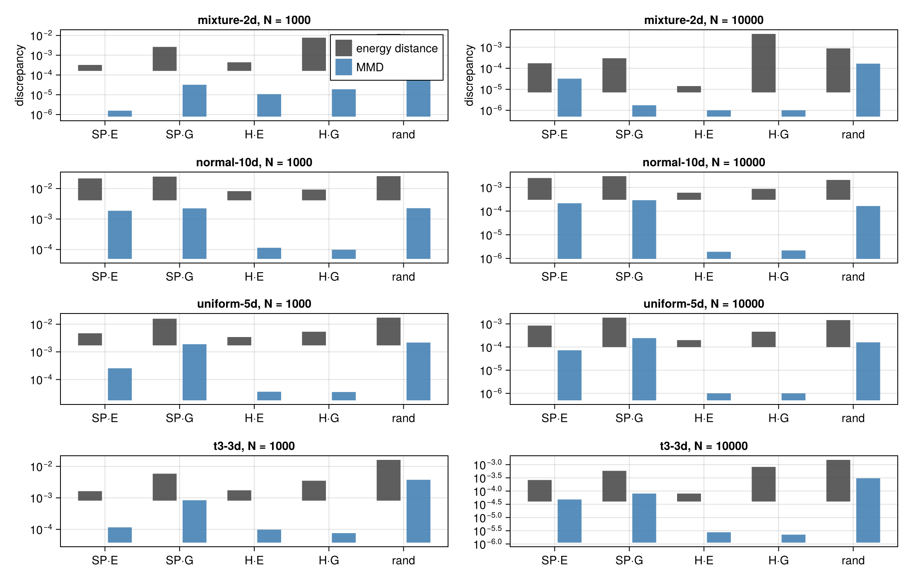
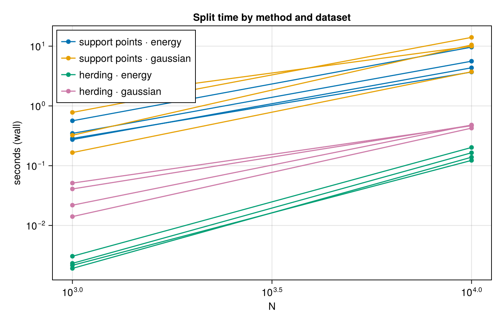
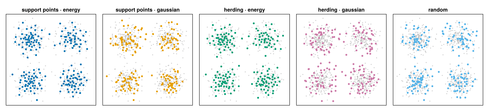

# [Benchmarks](@id benchmarks)

**Use `herding · energy` by default.** It has the lowest energy distance in
6 of the 8 (dataset, N) cases and the lowest Gaussian MMD in 3 of 4 at
``N = 10{,}000``, and it is the fastest optimized method at every size. At
``N = 1{,}000``, `support points · energy` wins `mixture-2d` on both
metrics and the `t3-3d` energy distance, and `herding · gaussian` has the
lowest MMD on the other three datasets. Reproduce with the command under
[Environment](@ref benchmarks-environment).

## Summary

| dataset | N | lowest energy distance | lowest MMD | fastest |
|---|---:|---|---|---|
| mixture-2d | 1000 | support points · energy | support points · energy | herding · energy |
| normal-10d | 1000 | herding · energy | herding · gaussian | herding · energy |
| uniform-5d | 1000 | herding · energy | herding · gaussian | herding · energy |
| t3-3d | 1000 | support points · energy | herding · gaussian | herding · energy |
| mixture-2d | 10000 | herding · energy | herding · energy | herding · energy |
| normal-10d | 10000 | herding · energy | herding · energy | herding · energy |
| uniform-5d | 10000 | herding · energy | herding · energy | herding · energy |
| t3-3d | 10000 | herding · energy | herding · gaussian | herding · energy |

Smaller discrepancy is better; times exclude JIT warm-up. Full per-cell
numbers are in the tables under [Results](@ref benchmarks-results). For
large inputs, `splitquality`'s automatic estimator is `RandomSlices(64)`
(`EnergyKernel`) or `RandomFeatures(512)` (`GaussianKernel`), chosen by the
selection experiment recorded under Results below ("Estimators").

## Setup

### Datasets

| dataset | distribution | dimensions |
|---|---|---:|
| mixture-2d | Gaussian mixture, 4 components | 2 |
| normal-10d | standard normal | 10 |
| uniform-5d | uniform on ``[0, 1]^5`` | 5 |
| t3-3d | Student-``t``, 3 degrees of freedom (heavy-tailed) | 3 |

All four datasets are seeded, and each is split with `ratio = 0.2` at
``N \in \{1{,}000, 10{,}000\}``.

### Methods

| method | splitter | N = 1,000 | N = 10,000 |
|---|---|---|---|
| support points · energy | `SupportPointSplitter(EnergyKernel())` | `kappa = nothing` (full data) | `kappa = 1_000` |
| support points · gaussian | `SupportPointSplitter(GaussianKernel())` | `max_iterations = 200` | `max_iterations = 100`; no stochastic mode |
| herding · energy | `HerdingSplitter(EnergyKernel())` | exact data term, no `kappa` | exact data term, no `kappa` |
| herding · gaussian | `HerdingSplitter(GaussianKernel())` | exact data term, no `kappa` | exact data term, no `kappa` |
| random | uniform random split | mean of 5 seeds | mean of 5 seeds |

### Protocol

- Measures energy distance and Gaussian-kernel MMD (median-heuristic
  bandwidth, resolved once per dataset) between the resulting train and
  test rows, plus wall-clock time.
- Every score is computed exactly via `splitquality(...; exact_threshold =
  typemax(Int))`, never the subsampled estimator, so there is no
  subsampling noise even at ``N = 10{,}000``.
- Each splitter's JIT warm-up runs on a throwaway copy seeded with
  `MersenneTwister(0)`, then the timed run uses a separate
  `MersenneTwister(1)`-seeded copy, so warm-up compilation never consumes
  the timed splitter's own random draws.
- The random split is the mean of 5 seeds.

### [Environment](@id benchmarks-environment)

Exact command:

```sh
julia -t auto --project=benchmark benchmark/run.jl
```

Recorded when the run below was produced:

- Julia: 1.10.12
- Threads: 16 (`-t auto`)
- CPU: AMD Ryzen 7 7800X3D 8-Core Processor

## [Results](@id benchmarks-results)

Best value per row in **bold**. The raw per-run table is
`assets/benchmarks/results.md`.

### Energy distance

| dataset | N | support points · energy | support points · gaussian | herding · energy | herding · gaussian | random |
|---|---:|---:|---:|---:|---:|---:|
| mixture-2d | 1000 | **0.000323** | 0.00264 | 0.000439 | 0.00772 | 0.012 |
| normal-10d | 1000 | 0.0215 | 0.0247 | **0.00822** | 0.00927 | 0.0255 |
| uniform-5d | 1000 | 0.0047 | 0.0158 | **0.00343** | 0.00535 | 0.0173 |
| t3-3d | 1000 | **0.00163** | 0.00586 | 0.00174 | 0.0035 | 0.0161 |
| mixture-2d | 10000 | 0.000173 | 0.0003 | **1.42e-5** | 0.00432 | 0.000885 |
| normal-10d | 10000 | 0.0025 | 0.00299 | **0.0006** | 0.000873 | 0.00208 |
| uniform-5d | 10000 | 0.000844 | 0.00187 | **0.000199** | 0.00046 | 0.00146 |
| t3-3d | 10000 | 0.000262 | 0.000583 | **8.06e-5** | 0.00082 | 0.00151 |

### Gaussian MMD

Bandwidth ``\sigma`` is the median-heuristic value, resolved once per
dataset.

| dataset | N | support points · energy | support points · gaussian | herding · energy | herding · gaussian | random |
|---|---:|---:|---:|---:|---:|---:|
| mixture-2d | 1000 | **1.57e-6** | 3.21e-5 | 1.08e-5 | 1.9e-5 | 0.00258 |
| normal-10d | 1000 | 0.00187 | 0.00224 | 0.000114 | **9.82e-5** | 0.00227 |
| uniform-5d | 1000 | 0.000255 | 0.00189 | 3.62e-5 | **3.54e-5** | 0.00217 |
| t3-3d | 1000 | 0.000116 | 0.000841 | 9.8e-5 | **7.58e-5** | 0.00375 |
| mixture-2d | 10000 | 3.2e-5 | 1.74e-6 | **1.87e-7** | 2.85e-7 | 0.000166 |
| normal-10d | 10000 | 0.000215 | 0.000289 | **1.91e-6** | 2.17e-6 | 0.000164 |
| uniform-5d | 10000 | 7.24e-5 | 0.000243 | **3.2e-7** | 4.64e-7 | 0.00016 |
| t3-3d | 10000 | 4.82e-5 | 8.06e-5 | 2.77e-6 | **2.25e-6** | 0.000305 |

### Wall time (seconds)

The random split does no optimization, so it is omitted here.

| dataset | N | support points · energy | support points · gaussian | herding · energy | herding · gaussian |
|---|---:|---:|---:|---:|---:|
| mixture-2d | 1000 | 0.29 | 0.17 | **0.0022** | 0.051 |
| normal-10d | 1000 | 0.56 | 1.3 | **0.0031** | 0.022 |
| uniform-5d | 1000 | 0.35 | 0.32 | **0.0023** | 0.041 |
| t3-3d | 1000 | 0.27 | 0.78 | **0.0019** | 0.014 |
| mixture-2d | 10000 | 3.7 | 3.7 | **0.12** | 0.47 |
| normal-10d | 10000 | 9.6 | 10.0 | **0.2** | 0.48 |
| uniform-5d | 10000 | 5.6 | 11.0 | **0.16** | 0.48 |
| t3-3d | 10000 | 4.3 | 14.0 | **0.14** | 0.43 |

### Estimators

Selection experiment for the `DiscrepancyEstimator` `splitquality` falls
back to above `exact_threshold`: on the four datasets above at
N = 10,000, absolute error against the exact value and wall time of every
candidate, measured on the split from `support points · energy`,
`herding · energy` (energy distance) and `herding · gaussian` (MMD), over 5
rng seeds. Full table:
[`assets/benchmarks/estimators.md`](assets/benchmarks/estimators.md).

| estimator | max abs error (worst over rows) | mean time (s) (over rows) |
|---|---:|---:|
| `Subsample(2000, 8)` (EnergyKernel) | 0.00197 | 0.208 |
| `RandomSlices(64)` | 0.00014 | 0.0189 |
| `RandomSlices(256)` | 7.65e-5 | 0.0835 |
| `RandomSlices(1024)` | 4.14e-5 | 0.331 |
| `Subsample(2000, 8)` (GaussianKernel) | 0.000175 | 0.298 |
| `RandomFeatures(512)` | 5.36e-7 | 0.0658 |
| `RandomFeatures(2048)` | 3.85e-7 | 0.325 |

Rule: an estimator becomes the automatic fallback if, at no more than
`Subsample(2000, 8)`'s mean wall time, its worst-case max error over every
row is at most one third of `Subsample(2000, 8)`'s; otherwise
`Subsample(2000, 8)` stays the fallback.

**Decision: `RandomSlices(64)` for `EnergyKernel`, `RandomFeatures(512)` for
`GaussianKernel`** — worst-case max error is 14× lower for `RandomSlices(64)`
(0.00197 → 0.00014) at 9% of `Subsample(2000, 8)`'s mean time, and 330×
lower for `RandomFeatures(512)` (0.000175 → 5.36e-7) at 22% of its time;
`ENERGY_FALLBACK` and `GAUSSIAN_FALLBACK` in `quality.jl` are set
accordingly.

### Approximate herding data terms (rejected)

Kernel herding's data term (`mean_l k(x_i, x_l)`, Chen, Welling & Smola
2010, Eq. 8) was tried with `RandomSlices`/`RandomFeatures` approximations
and rejected: all candidate rows share the same random directions or
features, so the estimator's noise is correlated across rows, and greedy
`argmax` selection tracks that noise rather than averaging it out. In the
table below the smallest budgets (k = 64 and 256, D = 512) select subsets
*worse than a random subset*; larger budgets beat random but stay 7–35×
from exact herding; only k = 8192 and D = 32768 come within about 3.5× —
at which point the estimator's own cost
(`O(kN log N)` for slices, `O(NDp)` for Fourier features) matches the exact
`O(N²)` data term for `N` around 10⁵. `RandomSlices`/`RandomFeatures` remain
available for `energydistance`/`mmd` quality diagnostics only;
`HerdingSplitter`'s data term is exact only. N = 1500, p = 3, n = 300, 3 rng
seeds per row.

| kernel | estimator | selected-subset discrepancy (3 seeds) | exact herding | random | ratio to exact |
|---|---|---|---:|---:|---:|
| EnergyKernel | RandomSlices(64) | 0.0255, 0.0561, 0.0692 (mean 0.0503) | 0.000643 | 0.00713 | 78.2× |
| EnergyKernel | RandomSlices(256) | 0.0181, 0.0222, 0.0262 (mean 0.0222) | 0.000643 | 0.00713 | 34.5× |
| EnergyKernel | RandomSlices(2048) | 0.00467, 0.00486, 0.0108 (mean 0.00679) | 0.000643 | 0.00713 | 10.6× |
| EnergyKernel | RandomSlices(8192) | 0.00138, 0.00252, 0.00228 (mean 0.00206) | 0.000643 | 0.00713 | 3.2× |
| GaussianKernel | RandomFeatures(512) | 0.00448, 0.00385, 0.00407 (mean 0.00413) | 5.88e-5 | 0.00268 | 70.3× |
| GaussianKernel | RandomFeatures(2048) | 0.0019, 0.00168, 0.00171 (mean 0.00177) | 5.88e-5 | 0.00268 | 30.0× |
| GaussianKernel | RandomFeatures(8192) | 0.000474, 0.000503, 0.000343 (mean 0.00044) | 5.88e-5 | 0.00268 | 7.48× |
| GaussianKernel | RandomFeatures(32768) | 0.000203, 0.000225, 0.000187 (mean 0.000205) | 5.88e-5 | 0.00268 | 3.48× |

## Figures



Grouped bars of energy distance and Gaussian MMD per method, one panel per
dataset and size, on a log scale; shorter bars are better splits.



Wall time versus ``N`` for each method, log–log; the random split is
excluded since it does no optimization.



The 2-D Gaussian-mixture data with the test rows each method selects
overlaid, showing why the methods disagree on which rows to hold out.

## Key findings

- **At N = 1,000, herding is competitive or ahead.** `herding · energy` has
  the lowest energy distance on `normal-10d` and `uniform-5d`, and
  `herding · gaussian` has the lowest MMD on `normal-10d`, `uniform-5d`, and
  `t3-3d`, all at a small fraction of the optimizer's wall time.
- **At N = 1,000, `support points · energy` still wins on two datasets.** It
  takes both metrics on `mixture-2d` and the energy distance on `t3-3d`.
- **At N = 10,000, `herding · energy` has the lowest energy distance on
  every dataset**, 3.3x-12.2x below `support points · energy`. Part of that
  gap is the `kappa = 1_000` stochastic approximation on the support-point
  side; on `normal-10d` and `uniform-5d` the runner-up is
  `herding · gaussian`, not `support points · energy`.
- **At N = 10,000, the two herding methods take the lowest MMD on every
  dataset**, well below both support-point methods and random (e.g.
  `normal-10d`: 1.91e-6 for `herding · energy` versus 0.000215 for
  `support points · energy`).
- **Herding is also the fastest optimized method at N = 10,000.**
  `herding · energy` takes 0.12-0.2 s and `herding · gaussian` 0.43-0.48 s,
  versus 3.7-9.6 s for `support points · energy` and 3.7-14.0 s for
  `support points · gaussian`, which now converges honestly on every
  cell — see Caveats for the quality/time trade that brings.
- **Herding uses the exact data term at every size**, so its selections
  realize the greedy rule's guarantee at ``N = 10{,}000`` as well as at
  ``N = 1{,}000``.
- **`RandomSlices(64)`/`RandomFeatures(512)` cut `splitquality`'s wall time
  above `exact_threshold` at errors within a few percent of the value**, but
  approximating herding's data term the same way was measured and
  rejected — the greedy selection amplifies the estimators' row-correlated
  noise; see "Approximate herding data terms (rejected)" under Results.

## Caveats

`support points · gaussian` now converges honestly on every cell, via the
scale-aware first step and two-part convergence rule
(`support_points(::GaussianKernel, …)`; see [Methods](@ref methods)). Before
that fix, the objective's ``1/n^2`` and ``1/(nN)`` scaling made the initial
gradient row-norms of order ``10^{-6}``, so on `normal-10d` and `uniform-5d`
the absolute displacement tolerance fired at the initial sample
(0.48-0.49 s, `result.converged == true`) even though further iterations
still decreased the objective; on `mixture-2d` and `t3-3d` the optimizer
instead ran the full 100-iteration cap without ever reporting convergence
(42 s). With the fix:

- `normal-10d` and `uniform-5d` no longer stop at the initial sample: they
  now take 10.0 s and 11.0 s (up from 0.48-0.49 s) and converge on the
  two-part rule to essentially the same quality as before (energy distance
  unchanged to 3 significant figures; MMD 0.000289 vs 0.000289, and
  0.000243 vs 0.000244) — the single accepted step the old code reported was
  already close to a local optimum, but the fix now reaches it by real
  iteration rather than an accidentally-tight tolerance. This is a
  convergence fix, not a quality fix: on Gaussian MMD at N = 10,000,
  `support points · gaussian` scores worse than the random split both
  before and after the fix, on `normal-10d` (0.000289 versus random's
  0.000164) and `uniform-5d` (0.000243 versus random's 0.00016).
- `mixture-2d` and `t3-3d` now converge honestly well before the
  iteration cap, in 3.7 s and 14.0 s (down from 42 s, an 11x and 3x
  speedup), at a slightly higher final MMD (mixture-2d: 1.74e-6 versus
  7.76e-7 before; t3-3d: 8.06e-5 versus 7.64e-5 before) — the
  relative-decrease rule (`rtol = 1e-8`) accepts diminishing returns earlier
  than running to the cap would, trading a small amount of quality for the
  speedup.
- At ``N = 1{,}000`` the same trade appears on all four datasets: wall time
  drops 2-6x (e.g. `mixture-2d`: 1.0 s to 0.17 s) alongside a modest
  increase in `support points · gaussian`'s own MMD score (`mixture-2d`:
  9.1e-6 to 3.21e-5).

None of this changes which method the Summary recommends: `support points ·
gaussian` is not the lowest-discrepancy method on any (dataset, N) cell, so
its exact stopping point does not affect the "use `herding · energy` by
default" recommendation.

`support points · energy` runs with `kappa = 1_000` at ``N = 10{,}000``,
so its ``N = 10{,}000`` numbers include stochastic-MM approximation error;
at ``N = 1{,}000`` both it and herding are exact.
