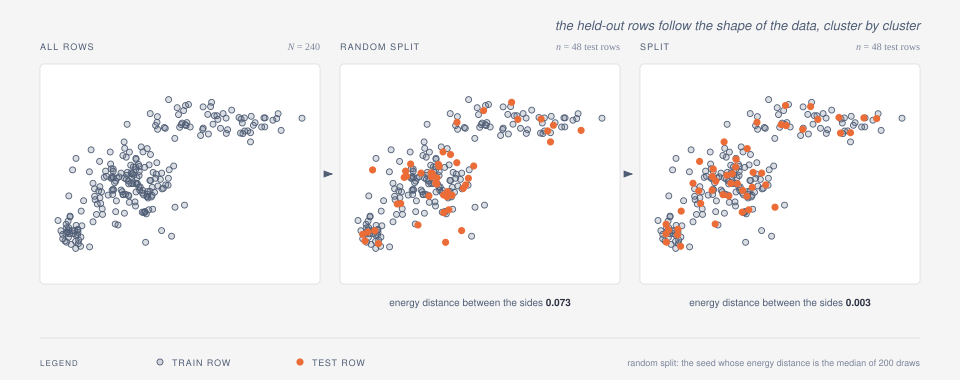
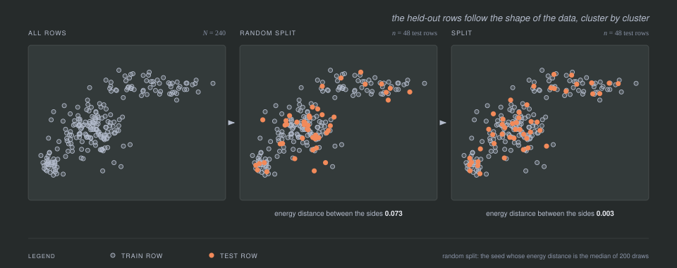

```@meta
CurrentModule = SPlit
```

# SPlit.jl

Distribution-preserving subset selection for tabular data and embeddings,
grown from SPlit ([Joseph and Vakayil, 2022](https://arxiv.org/abs/2012.10945)):
optimal train/test splits, k-fold multiplets, and training-data selection by
support points, kernel herding, twinning, and kernel thinning.




The figure is a real run on 240 two-dimensional rows: a random 20% test draw
lands unevenly across the three clusters, while the rows `datasplit` holds out
follow the shape of the data, and the energy distance between the two sides
drops by more than an order of magnitude.

## Overview

SPlit.jl chooses rows whose empirical distribution stays as close as
possible to a target measure, under the energy distance or the maximum mean
discrepancy. Three choices make up a call:

- **What you get.** `datasplit` returns a train/test partition, `multiplet`
  returns `k` distribution-balanced folds, and `selectrows` returns just the
  `n` chosen row indices.
- **What you match.** The data's own distribution by default; `weights`
  matches a quality-weighted version of it, `reference` matches a separate
  target sample while still drawing rows from the data.
- **How rows are chosen.** `SupportPointSplitter`, `HerdingSplitter`,
  `TwinningSplitter`, or `KernelThinningSplitter` — see
  [Methods](@ref methods) and [Benchmarks](@ref benchmarks) for how they
  differ.

The original method is SPlit: it computes *support points*, the sample of a
given size that minimizes the energy distance to the full data (Mak &
Joseph, 2018), and maps each support point to its nearest unclaimed data
row (Joseph & Vakayil, 2022). Unlike random splitting, this makes both the
train and test distributions close to the population distribution, which
improves the reliability of model evaluation. The other three splitters
select rows directly, without the continuous optimization step.

The rows need not be tabular: `standardize = false` passes a numeric matrix
through unchanged, which is what
[Selecting LLM training data](@ref llm-data-selection) uses on embedding
matrices.

The package also implements the optimal split ratio result of Joseph (2022):
for a linear model with `p` parameters, the test fraction that minimizes
the variance of the fitted model is `γ = 1 / (√p + 1)`.

New to support points? Read [How SPlit works](@ref intuition) first.

## Quick start

```julia
using SPlit, Random

data = randn(MersenneTwister(1), 1_000, 3)

# a train/test split
splitter = SupportPointSplitter(ratio = 0.2, rng = MersenneTwister(2))
result = datasplit(splitter, data)
train = data[result, :train]
test = data[result, :test]
splitquality(data, result)                 # energy distance, lower is better
optimal_split_ratio(data[:, 1:2], data[:, 3])

# a selection: 100 rows that stand in for the whole dataset
idx = selectrows(HerdingSplitter(), data, 100)

target_sample = randn(MersenneTwister(4), 50, 3)
# rows of data that match target_sample's distribution instead of data's own
idx_target = selectrows(SupportPointSplitter(), data, 100; reference = target_sample)

# embeddings: use the rows as they are, with no per-column standardization
embeddings = randn(MersenneTwister(5), 200, 16)   # rows already on the scale you want to keep
idx_embed = selectrows(HerdingSplitter(), embeddings, 50; standardize = false)
```

## Kernels and splitters

`SupportPointSplitter` accepts any `SplitKernel`. The default,
`EnergyKernel`, minimizes the energy distance of Mak & Joseph (2018).
`GaussianKernel` minimizes the squared maximum mean discrepancy (MMD²,
Gretton et al., 2012) instead, by projected gradient descent with Armijo
backtracking (full data; `kappa` runs a mean-shift MM sweep on subsamples);
see [Methods](@ref methods) for both objectives.

```julia
gauss = SupportPointSplitter(kernel = GaussianKernel(), rng = MersenneTwister(3))
result = datasplit(gauss, data)
result.method.kernel            # GaussianKernel with the resolved bandwidth
splitquality(data, result; kernel = result.method.kernel)   # MMD under the fitted kernel
```

`HerdingSplitter` builds the smaller subset directly by greedy kernel
herding (Chen, Welling & Smola, 2010) instead of computing support points:

```julia
herd = HerdingSplitter(kernel = GaussianKernel())   # deterministic, optimizer-free
result = datasplit(herd, data)
```

`TwinningSplitter` (Vakayil & Joseph, 2022) needs neither a kernel nor an
optimizer: it chains nearest-neighbor groups through the data and keeps
one row per group, in `O(pN log N)`. `multiplet` turns any splitter into
`k` distribution-balanced folds:

```julia
result = datasplit(TwinningSplitter(), data)          # deterministic, energy distance
folds = multiplet(TwinningSplitter(), data, 5)        # 5 folds, sizes within one row
```

`KernelThinningSplitter` (Dwivedi & Mackey, 2022, 2024) also selects rows
directly: KT-SPLIT halves a shuffled sequence of rows into candidate
subsets by randomized kernel halving, and KT-SWAP keeps the candidate
closest to the target measure and refines it by single-row swaps, with a
high-probability MMD guarantee neither `HerdingSplitter` nor
`TwinningSplitter` has:

```julia
kt = KernelThinningSplitter(kernel = EnergyKernel(), rng = MersenneTwister(4))
result = datasplit(kt, data)
```

See [Benchmarks](@ref benchmarks) for how the four splitters compare across
kernels and dataset sizes.

## Quality diagnostics

`energydistance`/`mmd` accept an `estimator` keyword for large inputs. See
[Methods](@ref methods) for what each `DiscrepancyEstimator` computes:

```julia
energydistance(X, Y; estimator = RandomSlices(256))
mmd(X, Y, GaussianKernel(1.0); estimator = RandomFeatures(2048))
```

## API reference

See the [Reference](@ref reference) section for complete API documentation.

## Algorithm details

1. Preprocessing. Categorical columns are Helmert-encoded, constant columns
   are dropped, and every remaining column is standardized to mean 0 and
   variance 1. `standardize = false` skips this step and uses the numeric
   matrix as it is.
2. Support-point computation. The kernel's majorization-minimization update
   moves a candidate point set, sweep by sweep, to minimize its energy
   distance to the data (Mak & Joseph, 2018). For large `n`, `kappa`
   switches to the stochastic variant that resamples rows each iteration.
   Under `GaussianKernel` the optimizer is projected gradient descent on the
   squared MMD instead (full data; `kappa` runs a mean-shift MM sweep on
   subsamples); see [Methods](@ref methods).
3. Nearest-neighbor assignment. Each support point claims its nearest
   unclaimed data row via a k-d tree (Joseph & Vakayil, 2022).
4. Partitioning. The claimed rows form the smaller subset and the rest form
   the larger one; `ratio` decides which of the two is the test set.

Planned work and its ordering are on the [Roadmap](@ref roadmap) page.

## References

1. Joseph, V. R., & Vakayil, A. (2022). SPlit: An Optimal Method for Data Splitting. *Technometrics*, 64(2), 166-176. [DOI](https://doi.org/10.1080/00401706.2021.1921037)

2. Mak, S., & Joseph, V. R. (2018). Support points. *The Annals of Statistics*, 46(6A), 2562-2592.

3. Joseph, V. R. (2022). Optimal Ratio for Data Splitting. *Statistical Analysis and Data Mining: The ASA Data Science Journal*, 15(4), 531-538.

4. Gretton, A., Borgwardt, K. M., Rasch, M. J., Schölkopf, B., & Smola, A. (2012). A Kernel Two-Sample Test. *Journal of Machine Learning Research*, 13, 723-773.

5. Chen, Y., Welling, M., & Smola, A. (2010). Super-Samples from Kernel Herding. *UAI*, 109-116.

6. Rahimi, A., & Recht, B. (2007). Random Features for Large-Scale Kernel Machines. *NIPS*, 20.

## Contributors

```@raw html
<!-- ALL-CONTRIBUTORS-LIST:START - Do not remove or modify this section -->
<!-- prettier-ignore-start -->
<!-- markdownlint-disable -->

<!-- markdownlint-restore -->
<!-- prettier-ignore-end -->

<!-- ALL-CONTRIBUTORS-LIST:END -->
```
